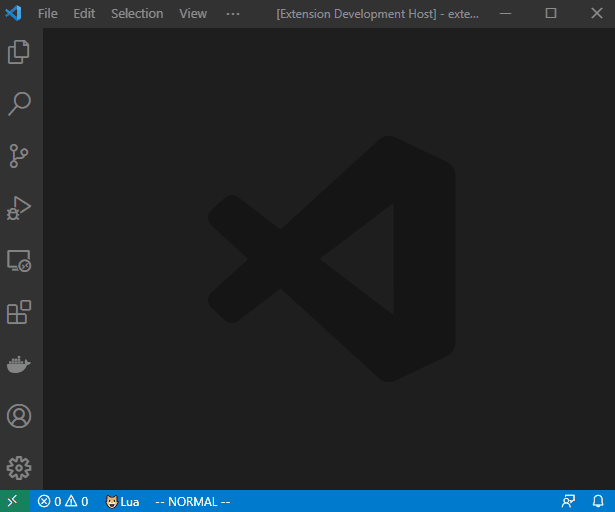
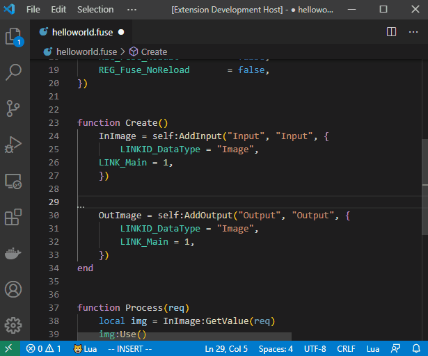
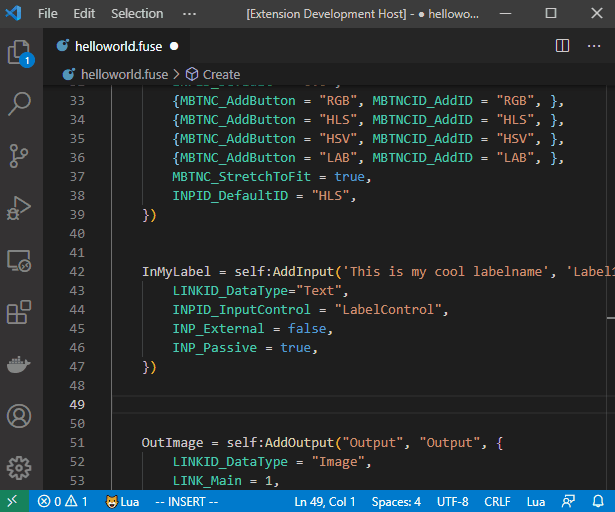
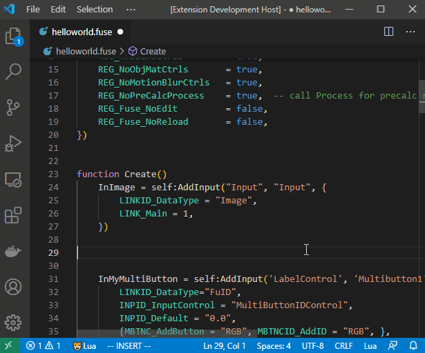

# Fuse-Snippets

Fuse-Snippets is a Vscode extension to help you create Fuses for Black Magic Design's Davinci Resolve Fusion aka "DaFusion"

## Features

* Start a fuse by typing **fuse-init**\

* A snippet for each input\

* Intellisense and documentation\

* Automagically create input vars in Process()\

## Requirements

Either Fusion or Davinci Resolve.

## Known Issues

Hopefully none :crossed_fingers:

## Release Notes

### 0.1.0

First beta release.

-----------------------------------------------------------------------------------------------------------

## Disclaimer

This is extension is in beta and there will be some edge cases that haven't been taken care of. Please help me make this extension better by creating an [issue](https://github.com/rne1223/fuse-snippets/issues). Thank you :pray:

## Credits

* [Sumneko for Lua Language Server Vscode extension](https://github.com/sumneko/lua-language-server)

## Acknowledgements

* numbr73 [youtube](https://www.youtube.com/channel/UCwb7CM0fYyyhymWMQVCJ4Lw) | [github](https://github.com/nmbr73/Shadertoys)
* cedricduriau [github](https://github.com/cedricduriau)
* LearnNowFx [youtube](https://www.youtube.com/channel/UC23pqsthkUONHvw38aqwkyA)
